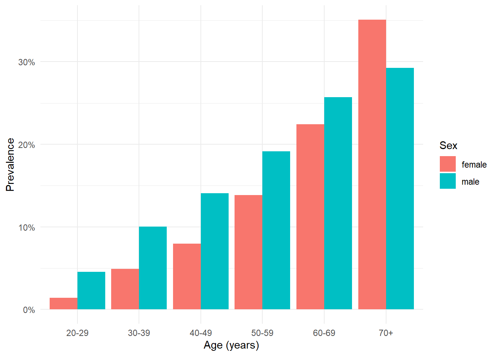
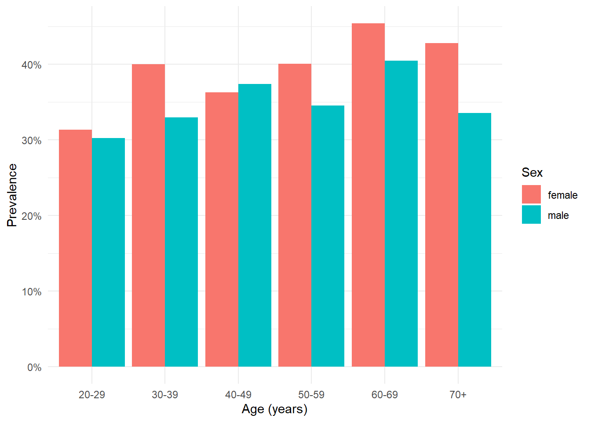
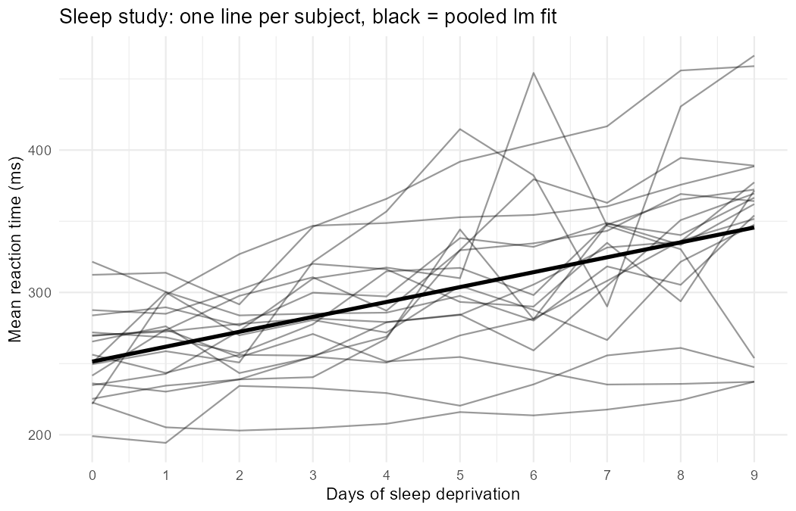

# NHANES cardiometabolic risk analysis

A learning project in R that analyses cardiometabolic risk in adults from the
NHANES sample (4,654 people aged 20 or older). It walks from a cleaned dataset
through descriptive tables and figures to a multivariable logistic model of
diabetes, with a Python wrapper that calls the R model script. A companion
script on the classic `sleepstudy` dataset introduces mixed-effects models.
All statistics are computed in R (tidyverse, gtsummary, broom, lme4); Python is
used only to orchestrate.

## Research questions

1. How prevalent are hypertension and obesity in NHANES adults, and how do they
   vary by age and sex?
2. After adjusting for age, sex, physical activity and smoking, how strongly is
   BMI associated with the odds of diabetes?
3. (Methods exercise) When measurements are repeated within people, how does a
   mixed-effects model change the estimate and uncertainty of a fixed effect
   compared with an ordinary regression?

## Files

| File | What it does |
|---|---|
| `adults_clean.csv` | Cleaned analysis dataset with derived variables: `hypertension`, `obese`, `bmi_cat`, `smoker`, `prehypertension`. |
| `report.qmd` | Quarto report. Table 1 by diabetes status (gtsummary), prevalence figures by age decade and sex, and a logistic regression with adjusted odds ratios. |
| `run_model.R` | Standalone script. Reads a CSV, fits the same logistic model as the report, and writes a tidy odds-ratio table with 95% CIs. Takes optional input and output paths as arguments. |
| `run_from_python.py` | Python orchestrator. Locates `Rscript`, runs `run_model.R` via `subprocess`, and prints the result with pandas. |
| `06_mixed.R` | Mixed-model exercise on `lme4::sleepstudy`. Fits a naive `lm`, a random-intercept `lmer` and a random-slope `lmer`, prints the ICC and likelihood-ratio test, and compares the `day` effect across models. |

## Reproducing the analysis

**R packages** (R 4.6.1 was used):

```r
install.packages(c("tidyverse", "gtsummary", "broom",
                   "lme4", "lmerTest", "broom.mixed", "performance"))
```

**Python**: 3.14 with pandas 3.x, used only for `run_from_python.py`.

**Commands**, run from the project root:

```sh
# Odds-ratio table from R directly
Rscript run_model.R adults_clean.csv odds_ratios.csv

# Same thing driven from Python
python run_from_python.py

# Mixed-model exercise (also writes fig_sleep_trajectories.png)
Rscript 06_mixed.R

# Full report -> report.html
quarto render report.qmd
```

Generated outputs (`report.html`, `odds_ratios.csv`) are not tracked in git;
the figures are, so that this README can display them.

## Key results

Hypertension was defined as systolic BP of 140 mmHg or higher or diastolic BP
of 90 mmHg or higher, on measured values only. Obesity was BMI of 30 kg/m² or
higher.

| Outcome | Prevalence |
|---|---|
| Hypertension | 15.3% |
| Obesity | 36.0% |
| Diabetes | 11.7% |

**Adjusted odds ratios for diabetes** (logistic regression, n = 4,608 complete
cases):

| Term | OR | 95% CI |
|---|---|---|
| BMI (per kg/m²) | 1.09 | 1.08 to 1.11 |
| Physically active (yes vs no) | 0.82 | 0.66 to 1.00 |
| Former smoker (vs never) | 1.14 | 0.91 to 1.43 |
| Current smoker (vs never) | 1.12 | 0.85 to 1.48 |
| Age (per year) | 1.06 | 1.05 to 1.07 |
| Male (vs female) | 1.40 | 1.15 to 1.71 |

**Hypertension prevalence by age and sex**



**Obesity prevalence by age and sex**



**Mixed-model exercise** (`sleepstudy`, 18 subjects x 10 days): the adjusted
ICC of the random-intercept model was 0.59, and the likelihood-ratio test
favoured the random-slope model (χ² = 42.1 on 2 df, p < 0.001). A linear mixed
model with random intercepts and slopes for subject showed reaction time
increased by 10.5 ms per day (95% CI 7.2 to 13.7).



## Data source

NHANES (US National Health and Nutrition Examination Survey), via the
`NHANES` R package sample. This is a teaching subset and is not survey-weighted,
so prevalence figures are not nationally representative.
